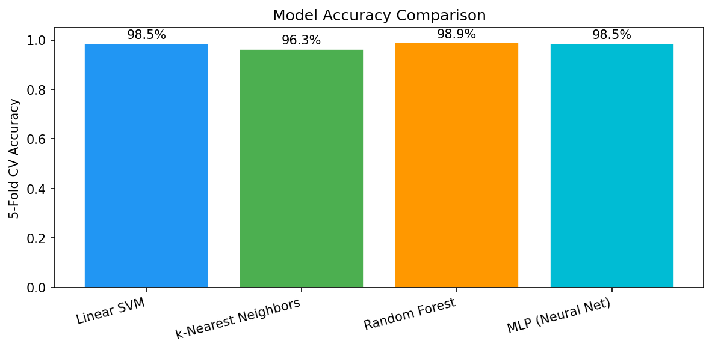
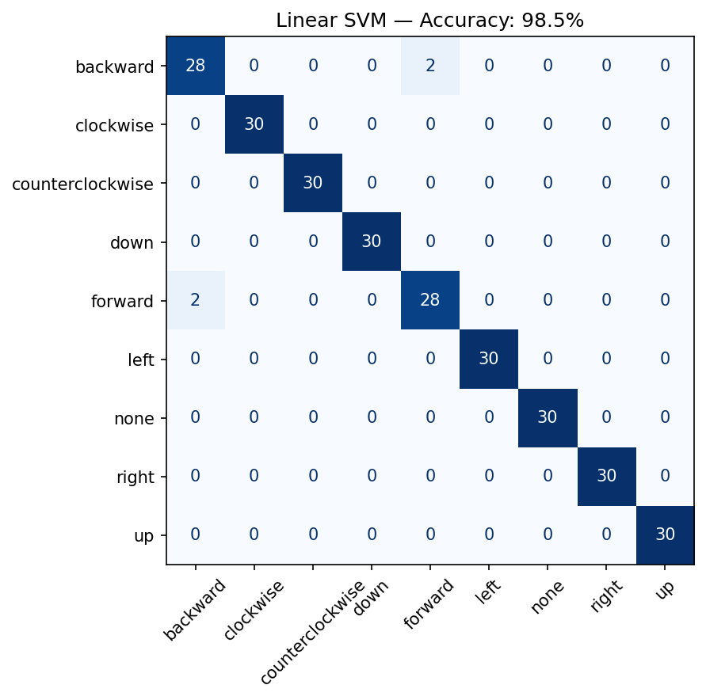

# Gesture Flight — IMU Gesture-Controlled Drone


**CS 528 — Mobile and Ubiquitous Computing | UMass Amherst**  
Anjali Kanvinde · Sribatscha Maharana · Vaikunth Elango

---

> *"The most profound technologies are those that disappear into the fabric of everyday life."*  
> — Mark Weiser, The Computer for the 21st Century, SIGMOBILE 1999

A wearable IMU-based hand gesture recognition system for intuitive drone control using real-time motion sensing and embedded processing.

---

## Demo

▶ [YouTube Demo](https://youtu.be/y-GpIlMdAIA) &nbsp;|&nbsp;
---

## How It Works

```
MPU6050 (on hand)
    ↓  I2C
ESP32-S3  →  captures 500 samples @ 250Hz over 2s
             extracts 60 features (10 stats × 6 channels)
             Linear SVM classifies gesture on-device
    ↓  USB Serial  →  PREDICTED:forward
Laptop (imu_control.py)
    ↓  WiFi
Tello Drone  →  send_rc() for 0.8s
```

The SVM runs entirely on the ESP32. There is no cloud, no serverand thus no latency beyond the capture window. This is edge ML: the classifier is a single matrix multiply implemented in C, small enough to fit in a microcontroller's flash alongside the sensor firmware.

---

## Gesture Set (8 commands + none)

| Gesture | Drone Command |
|---|---|
| Forward | Fly forward |
| Backward | Fly backward |
| Left | Fly left |
| Right | Fly right |
| Up | Fly up |
| Down | Fly down |
| Clockwise | Yaw right |
| Counterclockwise | Yaw left |
| None | Hover (no command) |

---

## Classifier Results

5-fold cross-validation on 30 samples × 9 classes (270 total):

| Model | CV Accuracy |
|---|---|
| **Linear SVM** | **98.5%** ← deployed |
| Random Forest | 98.9% |
| k-Nearest Neighbors | 96.3% |

We chose Linear SVM over Random Forest despite slightly lower offline accuracy because it maps directly to a single matrix multiply + bias, making it implementable in ~100 lines of C with no external libraries : critical for on-device ESP32 deployment where RAM is limited.



### Linear SVM Confusion Matrix (deployed model)



Forward/backward confusion was the hardest pair — resolved by standardizing gesture execution speed and range of motion relative to the training data.

---

## Hardware Setup

| MPU6050 Pin | ESP32-S3 Pin |
|---|---|
| VCC | 3.3V |
| GND | GND |
| SDA | GPIO 0 |
| SCL | GPIO 1 |

Mount the sensor flat on the back of your hand, chip facing up, USB port toward the wrist. **Orientation is a model parameter** — the classifier was trained in this exact position and must be used in the same orientation.

---

## Software Setup

```bash
git clone https://github.com/Anjali-Kan/imu-gesture-drone-control
cd imu-gesture-drone-control
pip install -r requirements.txt
```

**Flash the ESP32 firmware:**
1. Open `data/gesture_recognition/` in VS Code with the ESP-IDF extension
2. Select your serial port in the status bar
3. Click the flash button (⚡)

**Find your serial port (Mac):**
```bash
ls /dev/cu.*
```

---

## Usage

**ARM mode** — on-device C SVM (recommended, no Python model needed):
```bash
python src/imu_control.py --port /dev/cu.usbserial-XXXX --mode arm
```

**CSV mode** — Python SVM inference (requires trained `.pkl` model):
```bash
python src/imu_control.py --port /dev/cu.usbserial-XXXX --mode csv
```

**Keyboard controls (always active):**
- `T` — takeoff
- `N` — land  
- `ESC` — emergency stop + quit

**Optional flags:**
```
--no-video     skip Tello video stream
--speed N      RC speed 0–100 (default: 40)
--rest N       seconds between captures (default: 3)
```

---

## Project Structure

```
imu-gesture-drone-control/
├── data/
│   └── gesture_recognition/       # ESP32 ESP-IDF firmware project
│       └── main/
│           ├── main.c             # IMU capture + ARM/CSV command loop
│           ├── gesture_inference_template.c  # SVM inference in C
│           └── gesture_model_params.h        # Trained weights as C arrays
├── src/
│   ├── imu_control.py             # Main entrypoint — serial reader + drone control
│   ├── gesture_recognition.py     # Feature extraction (matches C implementation)
│   └── control/
│       ├── tello_controller.py    # djitellopy wrapper
│       └── gesture_bridge.py      # RC command bridge + keyboard fallback
├── report/
│   ├── compare_models.py          # Training + cross-validation script
│   └── figures/                   # Confusion matrices + accuracy charts
└── requirements.txt
```

---

## Known Limitations

- **2-second capture window** — each gesture cycle takes ~5s total (2s capture + 3s rest). Not suitable for fast reactive control.
- **Single-user model** — trained on one person's gesture data. Inter-user accuracy will be lower.
- **2.4GHz interference** — Tello's WiFi hotspot can interfere with ESP32's radio. If predictions degrade when drone is connected, add `esp_wifi_stop()` to firmware before the main loop.
- **Consistent execution required** — gestures must match the speed and range of motion used during training.

---

## Tech Stack

**Hardware:** ESP32-S3, MPU6050, DJI Tello  
**Firmware:** C, ESP-IDF  
**Python:** scikit-learn, NumPy, pyserial, djitellopy, opencv-python, pynput